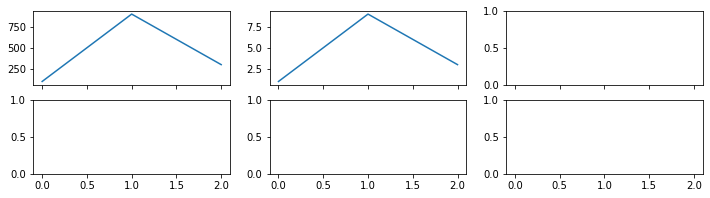

# Matplotlib - 层级结构

---

**Matplotlib图像内部层级结构**

* 容器类 (containers)
    * 图 (父图，figure)
    * 子图（Supplot），或 坐标系（axes）
    * 坐标轴 (axis)
    * 刻度 (tick)
* 基础类 (primitives)
    * 线 (line)
    * 点 (marker)
    * 文字 (text),
    * 图例 (legend)
    * 网格 (grid)
    * 标题 (title)
    * 图片 (image)
    * ...

    
**层级结构**

* 容器类包含基础类元素
* 容器类内元素也有层级结构，由底到顶为：`图->坐标系->坐标轴->刻度`
    * 一个图图包含一个或多个坐标系
    * 坐标系由坐标轴组成
        * 横轴xAxis
        * 纵轴yAxis
    * 坐标轴上有刻度
        * 主刻度MajorTicks
        * 副刻度MinorTicks


绘图时：定义完四个容器元素后，可在容器上添加各种基础元素，如：

* 在坐标轴和刻度上添加标签
* 在坐标系中添加线、点、网格、图例和文字
* 在图中添加图例等等


Matplotlib里这些元素都是对象，可以输出查看


```python
import numpy as np
import matplotlib.pyplot as plt
```


```python
fig, ax = plt.subplots()  # 图、坐标系

xax = ax.xaxis  # 坐标轴
yax = ax.yaxis

# 图和坐标系
print( 'fig.axes:', fig.axes, '\n')

# 坐标轴
print( 'ax.xaxis:', xax )
print( 'ax.yaxis:', yax, '\n' )

# 刻度
print( 'ax.xaxis.majorTicks:', xax.majorTicks, '\n' )  # 6个主刻度
print( 'ax.yaxis.majorTicks:', yax.majorTicks, '\n')
print( 'ax.xaxis.minorTicks:', xax.minorTicks )
print( 'ax.yaxis.minorTicks:', yax.minorTicks )
```

    fig.axes: [<matplotlib.axes._subplots.AxesSubplot object at 0x000002A13881DB00>] 
    
    ax.xaxis: XAxis(54.000000,36.000000)
    ax.yaxis: YAxis(54.000000,36.000000) 
    
    ax.xaxis.majorTicks: [<matplotlib.axis.XTick object at 0x000002A138810208>, <matplotlib.axis.XTick object at 0x000002A13880AC18>] 
    
    ax.yaxis.majorTicks: [<matplotlib.axis.YTick object at 0x000002A138830080>, <matplotlib.axis.YTick object at 0x000002A138810E10>] 
    
    ax.xaxis.minorTicks: [<matplotlib.axis.XTick object at 0x000002A138830C18>]
    ax.yaxis.minorTicks: [<matplotlib.axis.YTick object at 0x000002A13883BE10>]
    


## 容器类 - 父图和子图（图和坐标系）

图是整个图像层级的最低部容器

一幅图 (Figure) 中可以有多个子图 (Subplot)（或多个坐标系 (Axes)）

Subplot和Axes的区别
* 子图是坐标系的高级封装，在父图中以表格形式排列，可用类似数组查询的方式选择调用某个子图（常用）
* 坐标系更底层，操作繁琐但自定义性强


* Matplotlib中，**整个图像**为一个**figure父对象**
    * figure父对象是与用户交互的整个窗口
    * 用于在同一文件内绘制多个图像时的区分
* figure对象中包含一个或多个**axes(ax)子对象**
    * 每个ax子对象都是一个拥有自己独立坐标系的**绘图区域**
    * 用于在同一图像内绘制多个子图像的区分


---

绘图时如果不手动设置figure父窗口和ax子窗口，Matplotlib默认会自动创建：
* 一个figure窗口`figure(1)`
* 和一个ax子窗口`subplots(111)`

绘图，简写


```python
plt.plot([3,5,1,8,4])
```


    [<matplotlib.lines.Line2D at 0x2a138626668>]


等价于正常写法，面向过程（常用）


```python
plt.figure(1)  # 创建figure父图，默认编号为1
plt.subplot(1,1,1)  # 创建ax子图，默认：1行 1列 选中第1个

plt.xticks([1,2,3])  # 坐标轴x，和刻度
plt.yticks([4,5,6])  # 坐标轴y，和刻度

plt.plot([3,5,1,8,4])  # 在子图上画折线图像
```


    [<matplotlib.lines.Line2D at 0x2a138991e10>]


面向对象写法（了解），将窗口对象赋给变量


```python
a, b = 1, 2
a, b
```


    (1, 2)


```python
# fig = plt.figure(2)  # 创建父图
# ax = fig.add_subplot(1,1,1)  # 创建子图
fig, ax = plt.subplots()  # 创建父图和子图，前两句合并

ax.set(xticks=[1,2,3], yticks=[4,5,6])  # 坐标轴，和刻度

ax.plot([2,4,8,3])  # 给子对象绘图
```


    [<matplotlib.lines.Line2D at 0x2a138ab5860>]


### 创建多个figure父图


```python
plt.figure()  # 不加编号，默认是1
plt.plot([1,2,3])
plt.plot([2,1,3])

plt.figure(2)
plt.plot([3,1,0])

# 绘制到第二个父图中
plt.plot([4,0,2])

# 绘制到第1个父图中
plt.figure(1)
plt.scatter([1,2,3],[3,1,2])
```


    <matplotlib.collections.PathCollection at 0x2a139ce2ef0>


父图参数


```python
plt.figure(
    3,  # 图像编号，创建和选择图像使用
    figsize=(18, 5), # 图像大小，单位英寸
    facecolor='#cccccc',  # 背景颜色
    dpi=300,  # 分辨率，电脑看72，打印300起
)

plt.plot([2,9,3])
```


    [<matplotlib.lines.Line2D at 0x2a138c3cd30>]


### 创建多个子图

把图想成矩阵，子图就是矩阵中的元素，因此可像定义矩阵那样定义子图 
    
    subplot(行数、列数、第几个子图)


```python
plt.subplot(2,1,1)  # 2行1列，选中第一个
plt.plot([1,3,2])

plt.subplot(2,1,2)
```


    <matplotlib.axes._subplots.AxesSubplot at 0x2a13a5b3400>


```python
plt.subplot(1,2,1)
plt.subplot(1,2,2)
```


    <matplotlib.axes._subplots.AxesSubplot at 0x2a13a63e780>


```python
plt.figure(figsize=(10, 12))

plt.subplot(3,2,1)
plt.plot([1,2,3])

plt.subplot(322)  # 行列式1位数时，逗号可以省略
plt.subplot(323)
plt.subplot(324)
plt.plot([1,9,2])

plt.subplot(325)
plt.subplot(326)

# 调整子图间距
plt.subplots_adjust(
    hspace=0, # 行间距
    wspace=0,  # 列间距
)
```


### 父图和子图结合


```python
# 图1
plt.figure(1)
# 2个子图
plt.subplot(1,2,1)
plt.subplot(1,2,2)
plt.plot([1,8,2])

# 图2
plt.figure(2, figsize=(18, 5))
# 3个子图
plt.subplot(1,3,1)
plt.subplot(1,3,2)
plt.scatter([1,2,3,4,5],[3,5,1,8,4])
plt.subplot(1,3,3)
```


    <matplotlib.axes._subplots.AxesSubplot at 0x2a13b60add8>


### 面向对象的 父图、子图 结合的简写 （了解）


```python
# 简写，单个图
fig, ax = plt.subplots()
ax.plot([1,5,3,8,2])
ax.set_title('hello world')

# 简写，多个图
fig2, ax2 = plt.subplots(3,2) # 创建一个3行2列的图表
ax2
ax2[0,1].plot([1,2,3]) # 绘图，0,1表示选中第0行第1列的ax子图

# 带详细参数
fig3, ax3 = plt.subplots(
    figsize=(12,3), # 父窗口大小

    nrows=2, # 子图行数
    ncols=3, # 子图列数

    sharex=True, # 是否共享x轴
    sharey=False, # 是否共享y轴
)
ax3[0,0].plot([100,900,300])
ax3[0,1].plot([1,9,3])
```


    [<matplotlib.lines.Line2D at 0x2a13bd772b0>]





### 复杂绘图区域：pyplot子绘图区域（了解）

设定网格,选中网格,确定选中行列区域数量,编号从0开始

常用于数据面板，仪表板


```python
plt.figure(1, figsize=(17,10)) 

plt.subplot2grid(
    (4, 3),# 4行3列
    (0, 0),# 选中0行0列单元格
    colspan=3, #合并3列
)
plt.plot([2,1,9,5,4,8])


plt.subplot2grid((4,3),(1,0),rowspan=2,colspan=2) # 选中1行0列单元格，合并2行，合并2列
x = [1,3,5,7,9,11,13,15,17]
y = [2,-5,19,3,5,8,12,6,1]
plt.scatter(x, y)


plt.subplot2grid((4,3),(1,2),rowspan=2) #选中1行2列单元格，合并2行
plt.pie([2,6,9,15,1])

plt.subplot2grid((4,3),(3,0)) #选中3行0列单元格
plt.bar([1,2,3],[1,2,3])
plt.subplot2grid((4,3),(3,1)) #选中3行1列单元格
plt.bar([1,2,3],[3,9,1])
plt.subplot2grid((4,3),(3,2)) #选中3行2列单元格
plt.plot([3,5,2])

# 调整子图间距
plt.subplots_adjust(
    hspace=0, # 行间距
    wspace=0,  # 列间距
)
```


### 坐标系

比子图更底层、自定义性强

    plt.axes([l,b,w,h])

`[l, b, w, h]`可以定义坐标系

* l 代表坐标系左边到 Figure 左边的水平距离
* b 代表坐标系底边到 Figure 底边的垂直距离
* w 代表坐标系的宽度
* h 代表坐标系的高度

    长度是比例，如果lbwh都小于1，是标准化后的距离，如Figure底边长度为10， 坐标系底边到它的垂直距离为2， b=2/10=0.2


```python
plt.figure(figsize=(12, 8))

plt.axes([0.1, 0.1, 0.5, 0.5])
plt.axes([0.2, 0.2, 0.1, 0.1])
```


    <matplotlib.axes._axes.Axes at 0x2a13eeab710>


```python
plt.axes([0.1, 0.1, 0.5, 0.5])
plt.axes([0.2, 0.2, 0.5, 0.5])
plt.axes([0.3, 0.3, 0.5, 0.5])
plt.axes([0.4, 0.4, 0.5, 0.5])
```


    <matplotlib.axes._axes.Axes at 0x2a13ef4a7b8>


---

## 坐标轴和刻度

一个坐标系（Axes），通常是二维，有两条坐标轴（Axis）:
* 横轴：XAxis
* 纵轴：YAxis

每个坐标轴包含2个元素
* 容器类元素：刻度
    * 该对象还包含：刻度本身和刻度标签
* 基础类元素：标签
    * 该对象包含 坐标轴标签


```python
# 打印出 x 轴的子元素
fig, ax = plt.subplots()

print( ax.xaxis.get_label() )  # 标签
print( ax.xaxis.get_ticklocs() )  # 刻度位置点
print( ax.xaxis.get_ticklabels() )  # 刻度标签
print( ax.xaxis.get_ticklines() )  # 刻度线
print( ax.xaxis.get_ticks_position() )  # 刻度标签位置
print( ax.xaxis.get_major_ticks() )  # 主刻度
```

    Text(0.5, 0, '')
    [0.  0.2 0.4 0.6 0.8 1. ]
    <a list of 6 Text major ticklabel objects>
    <a list of 12 Line2D ticklines objects>
    bottom
    [<matplotlib.axis.XTick object at 0x000002A13EFADB00>, <matplotlib.axis.XTick object at 0x000002A13EFE1F60>, <matplotlib.axis.XTick object at 0x000002A13EFEECF8>, <matplotlib.axis.XTick object at 0x000002A13F012518>, <matplotlib.axis.XTick object at 0x000002A13F012C88>, <matplotlib.axis.XTick object at 0x000002A13F018208>]
    


```python
fig, ax = plt.subplots()

# 坐标轴标签
ax.set_xlabel('label X')
ax.set_ylabel('label Y')

ax.xaxis.get_ticklabels()[0].set_color('#ff0000')

for label in ax.xaxis.get_ticklabels():  # 刻度对象的刻度标签
    label.set_color('#ff0000')
    label.set_rotation(45)
    label.set_fontsize(20)
    
for line in ax.yaxis.get_ticklines():  # 刻度本身（一条短线）
    line.set_color('#00ff00')
    line.set_markersize(500)
    line.set_markeredgewidth(30)
```


#### 刻度

刻度（Tick）的核心是：
* 一条短线（刻度本身）
* 一串字符（刻度标签）


**刻度展示(了解)**：不同的 locator() 可以生成不同的刻度对象，我们来研究以下 8 种：

* NullLocator(): 空刻度
* MultipleLocator(a): 刻度间隔 = 标量 a
* FixedLocator(a): 刻度位置由数组 a 决定
* LinearLocator(a): 刻度数目 = a, a 是标量
* IndexLocator(b, o): 刻度间隔 = 标量 b，偏移量 = 标量 o
* AutoLocator(): 根据默认设置决定
* MaxNLocator(a): 最大刻度数目 = 标量 a
* LogLocator(b, n): 基数 = 标量 b，刻度数目 = 标量 n


```python
import matplotlib.ticker as ticker
```


```python
fig, ax = plt.subplots(figsize=(18,1), dpi=300)
ax.plot([3,5,1,8,4,6])

# ax.xaxis.set_major_locator(ticker.AutoLocator())
# ax.xaxis.set_minor_locator(ticker.AutoLocator())

# ax.xaxis.set_major_locator(ticker.NullLocator())
# ax.xaxis.set_minor_locator(ticker.NullLocator())

# ax.xaxis.set_major_locator(ticker.MultipleLocator(0.5))
# ax.xaxis.set_minor_locator(ticker.MultipleLocator(0.1))

# ax.xaxis.set_major_locator(ticker.FixedLocator([0,1,5]))
# ax.xaxis.set_minor_locator(ticker.FixedLocator(np.linspace(0,1,11)[1:-1]))

# ax.xaxis.set_major_locator(ticker.LinearLocator(3))
# ax.xaxis.set_minor_locator(ticker.LinearLocator(31))

# ax.xaxis.set_major_locator(ticker.IndexLocator(base=.5, offset=.25))

# ax.xaxis.set_major_locator(ticker.MaxNLocator(4))
# ax.xaxis.set_minor_locator(ticker.MaxNLocator(40))

ax.set_xlim(10**3, 10**10)
ax.set_xscale('log')
ax.xaxis.set_major_locator(ticker.LogLocator(base=10.0, numticks=15))
```


去除刻度


```python
# 面向过程
plt.plot([2,5,1,8,4])

plt.xticks([])
plt.yticks([])
```


    ([], <a list of 0 Text yticklabel objects>)


```python
# 面向对象
fig, ax = plt.subplots()
ax.plot([2,5,1,8,4])
ax.set(xticks=[], yticks=[])
```


    [[], []]


```python

```
