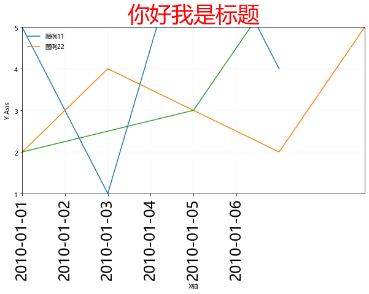
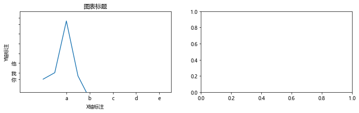

# 5 Matplotlib - 层级结构 - 基础类

---

## 子图之上的基础类元素

* Title 图表标题
    * plt.title()
* Label 坐标轴标注
    * plt.xlabel()
    * plt.ylabel()
* ...

和其他元素配合使用

* Tick Label 刻度设置和刻度标注
    * plt.xticks()
    * plt.yticks()
* Axis 坐标范围
    * plt.axis()  # ，x轴，y轴
        * plt.xlim()  # x轴坐标范围
        * plt.ylim()  # y轴坐标范围


```python
import matplotlib.pyplot as plt
plt.rcParams['font.family'] = ['Arial Unicode MS', 'Microsoft Yahei', 'SimHei', 'sans-serif']
```

## 面向过程的组件书写


```python
plt.figure(figsize=(10, 5))

n1, = plt.plot(
    [1,2,3,4,5],
    [3,5,1,8,4],
    label='图例11',
)

n2, = plt.plot(
    [1,3,5,7,9],
    [0,4,2,8,6],
    label='图例22',
)

n3, = plt.plot(
    [2,4,6,8,10],
    [2,3,9,1,4],
    label='图例33',
)


# 图像组件

# 标题
plt.title(
    '你好我是标题',
    fontsize=36,
    color='r',
)

# 坐标轴标注
plt.xlabel('X轴')
plt.ylabel('Y Axis')

# 刻度和刻度标注
plt.yticks([-2,-1,0,1,2,3,4,5,6,7,8,9])
plt.xticks(
    [2,2.5,3,3.5,4,4.5],  # 刻度位置
    ['2010-01-01','2010-01-02','2010-01-03','2010-01-04','2010-01-05','2010-01-06'],  # 自定义刻度标注
    rotation=90,  # 旋转
    fontsize=24,  # 字体大小
)

# 坐标轴范围,会和上面代码影响
# plt.axis([2, 6, 1, 5])  # x轴起始坐标，x轴结束坐标，y轴起始坐标，y轴结束坐标
plt.xlim([2, 6])  # x轴
plt.ylim([1, 5])  # y的

# 图例
plt.legend()  # 图例位置自动选择
# 图例位置可用参数：
# best 默认
# right
# center,center left,center right
# lower center,lower left,lower right
# upper center,upper left,upper right
plt.legend(
    handles=[n1, n2],  # 给指定数据绘制图例
    loc='upper left',  # 图例位置
    frameon=False  # 有无边框
)

# 网格
plt.grid(linewidth=0.2, alpha=0.5)

# 保存图像
# plt.savefig('temp/test')
plt.savefig(
    'temp/test2.jpg',  # 图像路径
    dpi=300,  # 分辨率
    bbox_inches='tight'  # 剪除当前图表周围的空白部分
)

# 非iPython环境显示图像
plt.show()
```





## 面向对象的组件书写（了解）

一般简单绘图使用面向过程写法，复杂绘图使用面向对象写法


```python
# 创建父对象，图像宽高可选
fig = plt.figure(figsize = (12, 3))

# 创建子对象，1行2列，选中第1个子图
ax = fig.add_subplot(121)
ax2 = fig.add_subplot(122)

# 子对象绘图
ax.plot([1,3,19,2,-5])

# 图表标题
ax.set_title('图表标题')

# 坐标轴标注
ax.set_xlabel('X轴标注')
ax.set_ylabel('Y轴标注')

# 刻度设置和刻度标注
ax.set_xticks([2,4,6,8,10])  #x 轴刻度设置
ax.set_yticks([1,3,6,9,12,15,18,20])  # y轴刻度设置

ax.set_xticklabels(['a','b','c','d','e'])  # x轴刻度标注
ax.set_yticklabels(['你','我','他'])  # y轴刻度标注

# 坐标范围
ax.axis([-2,11,-3,22])  # X轴-2到11,Y轴-3到22
```


    [-2, 11, -3, 22]





```python

```
