Python数据可视化学习内容

* Python可视化
    * Matplotlib
    * seaborn
    * Pandas可视化
* Web可视化
    * Echarts/Pyecharts
    
-------

Matplotlib常用图表
===


---

Matplotlib绘图一般用于数据可视化

常用的图表有：

* [折线图](#折线图)
* [散点图／气泡图](#散点图/气泡图)
* 条形图／柱状图
* 饼图
* 直方图
* 箱线图
* 热力图
  
需要学习的不只是如何绘图，更要知道什么样的数据用什么图表展示效果最好

---


```python
import numpy as np
import matplotlib.pyplot as plt
```

---

折线图
---

折线图用于显示随时间或有序类别的变化**趋势**


```python
x = [1,2,3,4,5,6]  # x轴坐标
y = [3,5,1,8,4,9]  # y轴坐标

plt.plot(x, y)
```


    [<matplotlib.lines.Line2D at 0x263258629b0>]


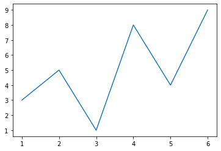


简写：只写一个轴坐标，默认y轴（x轴自增）


```python
plt.plot(y)
```


    [<matplotlib.lines.Line2D at 0x26325915ef0>]


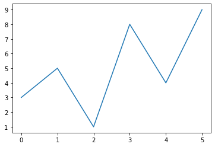


#### 线条和标记节点样式

标记字符：标记线条中的点

    线条颜色，color='g'
    线条风格，linestyle='--'
    线条粗细，linewidth=5.0
    标记风格，marker='o'
    标记颜色，markerfacecolor='b'
    标记尺寸，markersize=20
    透明度，alpha=0.5

---

#### 线条和标记节点格式字符（详见课件）

* 如果不设置颜色，系统默认会取一个不同颜色来区别线条
* 图像打印时，黑白打印机不能区分颜色,需要风格区分

---

    颜色字符	风格字符	标记字符1	标记字符2
    r 红色	- 实线	o 实心圈标记	1 下花三角标记
    g 绿色	-- 虚线,破折线	. 点标记	2 上花三角标记
    b 蓝色	-. 点划线	, 像素标记,极小的点	3 左花三角标记
    w 白色	: 点虚线,虚线	v 倒三角标记	4 右花三角标记
    '' 留空或空格,无线条	^ 上三角标记	s 实心方形标记
    c 青色		> 右三角标记	p 实心五角标记
    m 洋红		< 左三角标记	h 竖六边形标记
    y 黄色		* 星形标记	H 横六边形标记
    k 黑色		+ 十字标记	D 菱形标记
    x x标记	d 瘦菱形标记
    #00ff00 16进制		`	` 垂直线标记	
    0.8 灰度值字符串	


```python
plt.plot(
    [1,2,3,4,5,6],  # x轴坐标
    [3,5,1,8,4,9],  # y轴坐标

    # 线条样式
#     color='red',
#     color='r',
    color='#000000',  # 线条颜色
    linestyle='--',  # 线条样式
    linewidth=20,  # 线条粗细

    # 标记样式
    marker='*',  # 标记样式
    markerfacecolor='r',  # 标记颜色
    markersize=50,  # 标记大小
    
    alpha=0.5,  # 透明度
)
```


    [<matplotlib.lines.Line2D at 0x26325986908>]


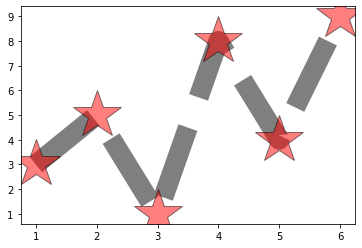


### 案例：绘制2017年7月国际外汇市场美元／人民币汇率走势图

    时间	收盘价
    2017年7月3日	6.8007
    2017年7月4日	6.8007
    2017年7月5日	6.8015
    2017年7月6日	6.8015
    2017年7月7日	6.8060
    2017年7月10日	6.8036
    2017年7月11日	6.8025
    2017年7月12日	6.7877
    2017年7月13日	6.7835
    2017年7月14日	6.7758
    2017年7月17日	6.7700
    2017年7月18日	6.7463
    2017年7月19日	6.7519
    2017年7月20日	6.7595
    2017年7月21日	6.7669
    2017年7月24日	6.7511
    2017年7月25日	6.7511
    2017年7月26日	6.7539
    2017年7月27日	6.7430
    2017年7月28日	6.7374
    2017年7月31日	6.7265


```python
# 汇率
eurcny = [6.8007,6.8007,6.8015,6.8015,6.8060,6.8036,6.8025,6.7877,6.7835,6.7758,6.7700,6.7463,6.7519,6.7595,6.7669,6.7511,6.7511,6.7539,6.7430,6.7374,6.7265]
# 日期
date = [3,4,5,6,7,10,11,12,13,14,17,18,19,20,21,24,25,26,27,28,31]

# 设置图像大小
plt.figure(figsize=(18, 8))

# 折线图
plt.plot(
    date,
    eurcny,
    
    color='r',
    linestyle='--',
    linewidth=15,
    
    marker='o',
    markersize=30,
    markerfacecolor='g',
    
    alpha=0.3,
)

plt.plot(eurcny)

plt.grid(linewidth=0.2, alpha=0.5)
```


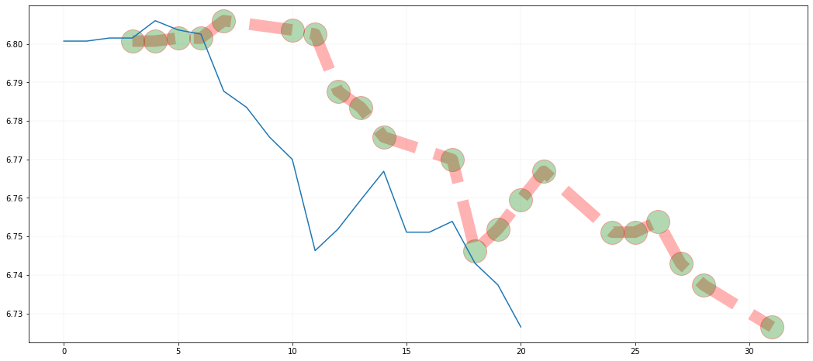


---

散点图/气泡图
---

散点图作用：

* 单组数据，可以查看数据分布（不常用，最好使用直方图实现）
* 多组数据，可以查看各数据之间是否存在相关性

坐标系中,每个值用一个点（x轴，y轴确定）表示


```python
# 数据
x = [1,3,5,7,9,11,13,15,17]
y = [2,-5,19,3,5,8,12,6,1]

plt.scatter(x, y)
```


    <matplotlib.collections.PathCollection at 0x26325d43f28>


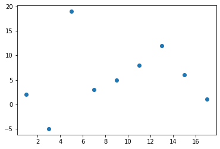


```python
plt.scatter(
    [1,3,5,7,9,11,13,15,17],  # x轴坐标
    [2,-5,19,3,5,8,12,6,1],  # y轴坐标

#     color='r',  # 点颜色
    c=[1,2,3,4,5,6,7,8,9],
    marker='*',  # 点样式
    linewidth=1,  # 线宽
    alpha=0.5,  # 透明度
    
    # 点大小
#     s=1000,
    s=[50, 100, 150, 200, 250, 300, 350, 400, 450],
)

# 第二组散点图
plt.scatter(
    [10, 12, 16, 18],
    [5, 10, 12, 15],
)
```


    <matplotlib.collections.PathCollection at 0x26325a26c18>


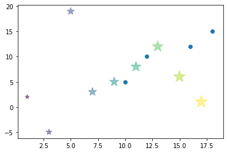


----

### 案例：居民年龄/收入和超市销售额数据分析报告

#### 1. 背景介绍

    xx超市是一家小型综合性社区超市，
    
    * 年营业额xx元
    * 针对用户群体，周边住户
    。。。。

数据：

* 顾客年龄
* 顾客年收入
* 顾客年购物金额


    年龄	收入	销售额
    34	350	123
    40	450	114
    37	169	135
    30	189	139
    44	183	117
    36	80	121
    32	166	133
    26	120	140
    32	75	133
    36	40	133

需求

* 分析出超市销售额和顾客年龄、收入的关系
* 解释关系产生的原因
* 提出解决建议方案

#### 2：数据读入

数据清洗略


```python
# 年龄
age = [34,40,37,30,44,36,32,26,32,36]
# 收入
income = [350,450,169,189,183,80,166,120,75,40]
# 销售额
sales = [123,114,135,139,117,121,133,140,133,133]
```

#### 3：指标计算

计算用户样本数量


```python
len(age)
```


    10


计算用户平均年龄


```python
(34 + 40 + 37 + 30 + 44 + 36 + 32 + 26 + 32 + 36) / 10
np.mean(age)
```


    34.7


计算用户年均收入中位数


```python
np.median(income)
```


    167.5


计算用户年均销售额


```python
np.mean(sales)
```


    128.8


#### 4. 数据可视化

年龄和销售额的关系


```python
plt.scatter(age, sales)
```


    <matplotlib.collections.PathCollection at 0x26325affe10>


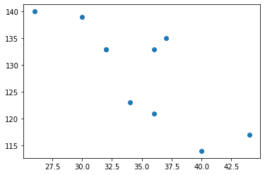


年收入和销售额的关系


```python
plt.scatter(income, sales)
```


    <matplotlib.collections.PathCollection at 0x26325b44a20>


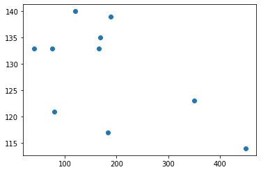


将三个列表绘制到一张图中

1. x轴，年龄
1. y轴，销售额
1. z轴，散点大小，年收入


```python
plt.scatter(age, sales, s=income, alpha=0.5)
```


    <matplotlib.collections.PathCollection at 0x26325bc3400>


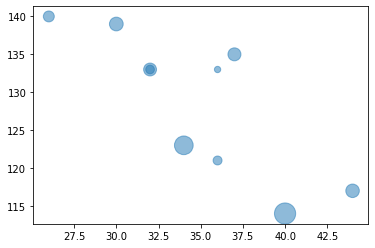


#### 5：结论

* 随着用户年龄的增加，销售额逐渐降低
* 随着用户收入的增加，销售额也在降低

#### 原因：

* 老年人的消费水平不高，只买便宜商品
* 高收入用户群体较少在本超市消费

本超市的主流用户群体，是发展中的年轻人，销售商品偏年轻化、平民化。

#### 意见建议：

针对超市宣传推广营销活动的建议：

* 营销针对特定用户群体
    * 年龄25-37岁之间
    * 年收入20万元以下
* 应针对上述发展中的年轻人进行宣传推广活动

---

奥卡姆剃刀原理：

    如无必要，勿增实体

---

条形图／柱状图
---

* 条形图（横向）
* 柱状图（纵向）

条形图和柱状图用来比较各**独立类别**下的单独数据的**大小**


```python
x = [1,2,3,4,5]
y = [3,6,1,8,2]
```

柱状图


```python
plt.bar(x, y)
```


    <BarContainer object of 5 artists>


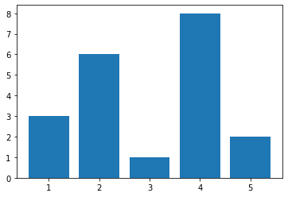


```python
plt.bar(
    x,
    y,
    
    width=0.5,  # 柱子粗细
    color='r',
    alpha=0.3,
)

# 修改坐标标注
# plt.xticks([1,2,5,8,10])
plt.xticks([1,2,3,4,5], ['a', 'b', 'c', 'd', 'e'])
plt.yticks([3,6,1,8,2], [11,22,33,44,55])

plt.show()
```


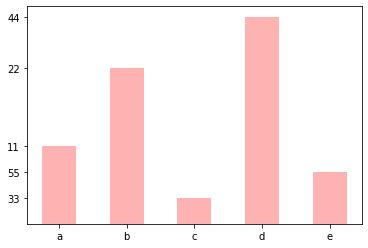


条形图

* 条形图粗细属性：height
* 条形图的x、y坐标翻转


```python
plt.barh(x, y, height=0.5,)
```


    <BarContainer object of 5 artists>


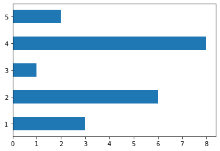


---

### 案例：某班级男生和女生各科成绩平均分数据可视化

学科 | 男生 | 女生
---- | ---- | -----
语文 | 85.5 | 94
数学 | 91 | 82
英语 | 72 | 89.5
物理 | 59 | 62
化学 | 66 | 49


```python
# 男生平均分，语文／数学／英语／物理／化学
boy = [85.5,91,72,59,66]
# 女生平均分
girl = [94,82,89.5,62,49]
```


```python
# 男生成绩

x = [1,2,3,4,5]
plt.bar(
    x,
    boy,
    
    width=0.3,
    color='g',
    alpha=0.3,
)

# 女生成绩
x2 = [1.3, 2.3, 3.3, 4.3, 5.3]
plt.bar(
    x2,
    girl,
    
    width=0.3,
    color='r',
    alpha=0.3,
)

# 坐标轴和坐标轴标注
plt.xticks([1.15, 2.15, 3.15, 4.15, 5.15], ['Chi','Math','Eng','Phy','Che'])


# 了解，将数据标注在柱子上
# plt.text(3, 50, 'abcde')

for i,j in zip(x, boy):
    plt.text(
        i,  # x轴，course学科位置
        j,  # y轴，boy分数
        '%.1f' % j,  # 数据转为一位小数
        ha='center', # 水平对齐
        va='bottom', # 垂直对齐
        alpha = 0.5,
    )

for i,j in zip(x2, girl):
    plt.text(
        i,
        j,
        '%.1f' % j,
        ha='center',
        va='bottom',
        alpha = 0.5,
    )

plt.grid(linewidth=0.1)
plt.show()
```


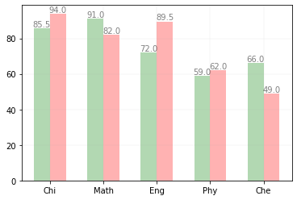


---

饼图
---

饼图用于显示各项相对总和的百分比大小


```python
# 数据，会被饼图自动转换为百分比
p = [15,30,45,10]

plt.pie(p)
plt.show()
```


### 案例：2017年9国军费占比数据可视化

    国家	军费占比
    美国	0.5548467
    中国	0.14444868
    印度	0.05094268
    沙特	0.04846696
    俄国	0.046753
    日本	0.04418206
    英国	0.04161112
    德国	0.03799276
    法国	0.03075605


```python
# 国名
mark = ['America','China','India','Saudi','Russia','Japan','Britain','Germany','France']
# 各国占9国总军费的比例
percent = [0.5548467,0.14444868,0.05094268,0.04846696,0.046753,0.04418206,0.04161112,0.03799276,0.03075605]

plt.figure(figsize=(8, 8))

plt.pie(
    percent,  # 百分比
    labels = mark,  # 名称
    explode=(0,0.1,0,0,0,0,0,0,0),  # 突出块，突出比例
    autopct='%1.1f%%',  # 显示百分比方式
    startangle=-110,  # 饼图起始的角度,度数,默认0为右侧水平180度开始，逆时针旋转
)

plt.axis('equal')  # 正圆形饼图,x/y轴尺寸相等.默认是扁图
plt.show()
```


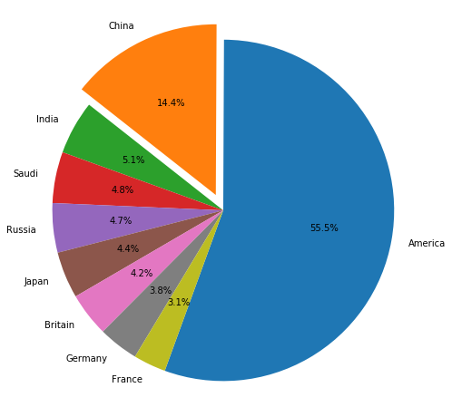


---

直方图
---

    直方图是数据离散化的可视化

直方图是表达数据的**分布情况**的统计图表，一般用来表示同等区间内,某类数值出现的个数或频率(频率=出现次数/总数)

x轴表示分组数据，y轴表示分布情况

从频率分布直方图可以直观估计出：

* 众 数：频率分布直方图中最高矩形的底边中点的横坐标
* 中位数：把频率分布直方图分成两个面积相等部分的平行于Y轴的直线横坐标

直方图与柱状图的区别：

* 直方图：分区之间连续无间断，表示连续变量；值用矩形面积表示
* 条形图：各柱之间有间隙，表示孤立的、不连续分类变量；值用矩形长度表示

### 案例：1班和2班语文成绩统计数据可视化


```python
# 成绩数据
h1 = [ 88.2,  83.5,  68.8,  85.4,  78.6,  69.3,  60.6,  91.2,  52.7,
        85.9,  57.1,  68. ,  66.6,  78.2,  78.8,  85. ,  89.1,  74.4,
        93.6,  75.7,  54.3,  55. ,  90.9,  79.4,  94.4,  86.7,  82.4,
        76.7,  78.7,  72.3,  83.9,  78.6,  80. ,  70.5,  87.1,  80.3,
        87.9,  65.1,  67.4,  61.5,  49.7,  77.1,  91.4,  72. ,  61.5,
        73.9,  76.9,  88.2,  51.2,  53.9]

h2 = [ 79.5,  99. ,  80. ,  71. ,  79.2,  85.6,  79.2,  68.8,  68.7,
        96.5,  63.8,  81.8,  76.9,  80. ,  73.8,  77.1,  79.6,  76.8,
        73.9,  73.2,  66. ,  76.2,  76.4,  65.3,  75.2,  74.5,  87.5,
        78.4,  95. ,  72.6,  86. ,  71.7,  71. ,  87.7,  83.9,  76.8,
        72.3,  67. ,  67.8,  79.6,  81.9,  83. ,  65.6,  91.6,  75.5,
        77.6,  82.8,  87.5,  75.1,  79.4]
```


```python
plt.hist(h1)
```


    (array([ 4.,  3.,  3.,  3.,  5.,  4., 11.,  5.,  7.,  5.]),
     array([49.7 , 54.17, 58.64, 63.11, 67.58, 72.05, 76.52, 80.99, 85.46,
            89.93, 94.4 ]),
     <a list of 10 Patch objects>)


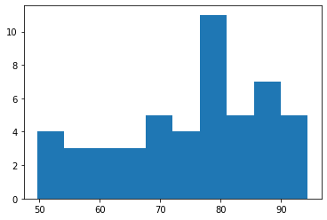


```python
plt.hist(
    h1,  # 直方图数据
    10,  # 直方个数
    density=1,  # 默认0 数据出现个数，1 出现个数归一化为出现的频率
    histtype='bar',  # 直方图样式：默认bar，stepfilled填充颜色，step不填充只有线条
    facecolor='gray',  # 直方图颜色
    edgecolor = 'w',  # 直方图边框颜色
    alpha=0.3,
)

# 直方图叠加
plt.hist(h2, 10, density=1, histtype='bar', facecolor='r', alpha=0.3)
```


    (array([0.02840909, 0.01704545, 0.04545455, 0.0625    , 0.05113636,
            0.02840909, 0.02840909, 0.00568182, 0.00568182, 0.01136364]),
     array([63.8 , 67.32, 70.84, 74.36, 77.88, 81.4 , 84.92, 88.44, 91.96,
            95.48, 99.  ]),
     <a list of 10 Patch objects>)


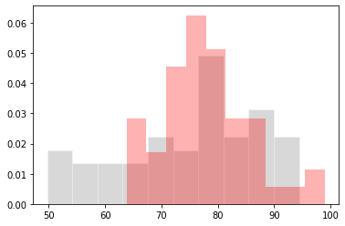


---

箱线图
---

箱线图又名盒须图，是一种用作显示一组数据离散情况的统计图表，常用作多组数据的综合统计比较

四分位数的可视化：

    第一四分位数(Q1)，又称“较小四分位数”，等于该样本中所有数值由小到大排列后第25%的数字。
    第二四分位数(Q2)，又称“中位数”，等于该样本中所有数值由小到大排列后第50%的数字。
    第三四分位数(Q3)，又称“较大四分位数”，等于该样本中所有数值由小到大排列后第75%的数字。
    
箱线图主要包含5个统计量，从上到下，从高到低：

    最大非异常值，上边线
    Q3，箱体上边缘上四分位数
    Q2，中位数线
    Q1，箱体下边缘下四分位数
    最小非异常值，下边线
    除了上面5个统计量，上下边缘外侧可能还有异常值

Q3和Q1的差值，即四分位数差
* 大于Q3 1.5倍四分位数差的值，或者小于Q1 1.5倍四分位数差的值，划为异常值


```python
a = [15,5,9,22,4,-5,45,-22]
plt.boxplot(a)
plt.show()
```


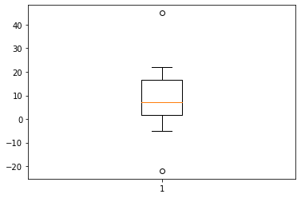


### 案例：某班级a/b/c三组学员数学成绩统计分析可视化

    组别\编号	1	2	3	4	5	6	7	8
    a	42	55	79	68	15	98		
    b	32	59	77	100	92	88	5	0
    c	92	98	78	65	97	100	0


```python
a = [42,55,79,68,15,98]
b = [32,59,77,100,92,88,5,0]
c = [92,98,78,65,97,100,0]

plt.boxplot(
    (a, c, b),
    labels=('a','c','b'),  # 标签

#     showfliers = False,  # 是否显示异常值，默认显示
#     whis = 1.5,  # 指定异常值参数：默认1.5倍四分位差
    showmeans = True, # 是否显示平均值，默认不显示
    meanline = True, # 是否用线标示平均值，默认用点

    widths = 0.5, # 柱子宽度

#     vert = False, # 默认True纵向，False横向
    patch_artist = True,  # 是否填充颜色
    boxprops = {'facecolor':'#ffff00','color':'green'}, # 箱体样式
)

plt.show()
```


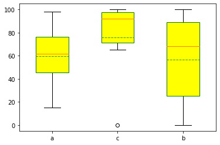


---

众数、平均数，中位数的区别

* 众数：出现频率最高的数，没什么用
* 平均数：
    * 对极端值非常敏感
* 中位数：
    * 对极端值不敏感
    * 95%置信区间

---

总结：

* 数据区间范围固定的，一般用平均值
* 数据区间范围不固定，一般用中位数或者95%置信区间

比赛打分之所以使用平均数，利用平均值的敏感（中位数会出现大量的相同分数），

同时为了降低平均值的敏感程度，去掉最高分和最低分


```python
a = [1,2,3,4,5,6,7,8,9,10,11]

# 平均值，中位数
np.mean(a), np.median(a)
```


    (6.0, 6.0)


```python
a = [1,2,3,4,5,6,7,8,9,10,11, 10000]

# 平均值，中位数
np.mean(a), np.median(a)
```


    (838.8333333333334, 6.5)


---

热力图
---

热力图以二维形式展示数据的大小，主要用于数据的重要程度／相关度展示


```python
a = [
    [1, 2, 3],
    [4, 5, 6],
    [7, 8, 9]
]

plt.imshow(a)
```


    <matplotlib.image.AxesImage at 0x26327082748>


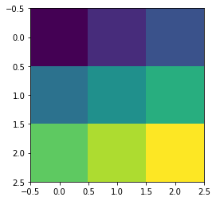


```python
plt.imshow(
    a,  # 数据
    cmap='gray',  # 配色，gray灰度
#     origin='lower', # 水平翻转，默认upper,lower
#     interpolation='lanczos', # 渲染，模糊
)

plt.colorbar() #侧栏
```


    <matplotlib.colorbar.Colorbar at 0x26325d7f9e8>


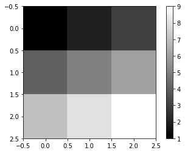


### 例子：可视化班级同学成绩和座位关系


```python
a = np.random.randint(0, 100, (10, 10))
a
```


    array([[32, 15, 45, 44, 51, 76, 16, 93, 34, 31],
           [92,  4, 79, 25, 32, 80, 86, 55,  8, 30],
           [18, 58, 81, 85, 13, 38, 23, 57,  3, 25],
           [80, 31, 56, 53, 58,  7, 55, 92, 74, 16],
           [84, 13,  0, 87, 48, 96, 71, 52, 86, 48],
           [48, 23, 87, 69, 44, 84, 58, 73, 91,  0],
           [62, 45, 97, 48, 76, 18, 73, 84, 27, 79],
           [34,  3, 14, 11, 96, 65, 89, 11, 93, 69],
           [62, 69, 94, 94,  7, 66, 23, 49, 84, 77],
           [67, 59, 68, 70, 92, 69, 53, 50, 59, 87]])


```python
plt.figure(figsize=(10, 10))

plt.imshow(
    a,  # 数据
#     cmap='gray',  # 配色，gray灰度
    interpolation='lanczos', # 渲染，模糊
)

plt.xticks([0,1,2,3,4,5,6,7,8,9])
plt.yticks([0,1,2,3,4,5,6,7,8,9])

plt.grid()
plt.colorbar() #侧栏
```


    <matplotlib.colorbar.Colorbar at 0x26327a235f8>


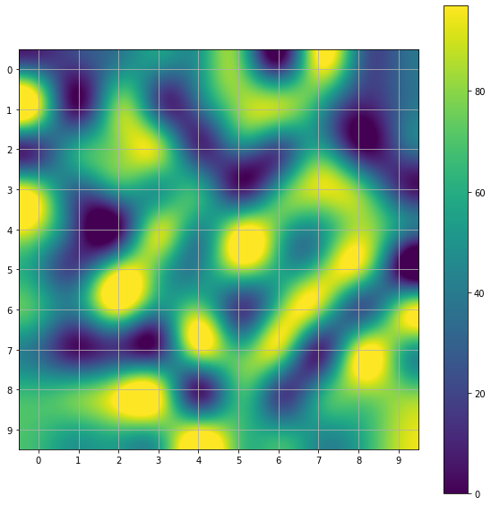


叠加图像到背景上

    # 灰度图像
    [
        [3,50,2,4],
        [45,22,3,4],
        [1,2,3,4],
    ]
    
    # 彩色图像
    [
        [[255, 0, 255],[255, 0, 255],[255, 0, 255],[255, 0, 255]],
        [[255, 0, 255],[255, 0, 255],[255, 0, 255],[255, 0, 255]],
        [[255, 0, 255],[255, 0, 255],[255, 0, 255],[255, 0, 255]],
    ]


```python
img = plt.imread('images/xiangnong.jpg')  # 载入图像，像素值转为组
img
```


    array([[[140, 122, 100],
            [103,  90,  74],
            [ 88,  78,  69],
            ...,
            [211, 199, 175],
            [181, 169, 145],
            [178, 164, 138]],
    
           [[118, 102,  79],
            [112, 100,  86],
            [ 82,  73,  64],
            ...,
            [204, 192, 168],
            [177, 165, 141],
            [176, 162, 136]],
    
           [[248, 233, 212],
            [215, 208, 192],
            [126, 122, 111],
            ...,
            [216, 204, 180],
            [194, 182, 158],
            [196, 182, 156]],
    
           ...,
    
           [[ 86,  76,  66],
            [ 84,  74,  65],
            [ 82,  73,  64],
            ...,
            [ 96,  88,  77],
            [ 84,  76,  65],
            [ 72,  66,  54]],
    
           [[ 88,  79,  70],
            [ 87,  78,  69],
            [ 91,  84,  76],
            ...,
            [ 63,  64,  59],
            [ 59,  60,  55],
            [ 71,  71,  69]],
    
           [[ 93,  79,  68],
            [103,  89,  78],
            [ 94,  80,  69],
            ...,
            [ 66,  65,  61],
            [ 68,  67,  62],
            [ 72,  69,  64]]], dtype=uint8)


```python
plt.imshow(img)
```


    <matplotlib.image.AxesImage at 0x26327a657b8>


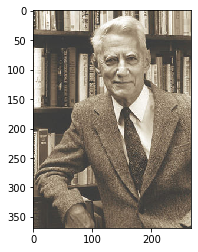


```python
extent = (0, 25, 0, 25)  # 按 左右下上 位置拉伸填充图像
plt.imshow(img, extent=extent)

plt.plot([0,4,6,2,10,20])
plt.scatter(
    [12.5, 15.5],
    [19, 19.5], 
    s=[100, 200], 
    color='r', 
    alpha=0.7,
)

plt.axis("off")  # 去掉坐标轴
```


    (0.0, 25.0, 0.0, 25.0)


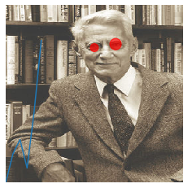


```python

```
